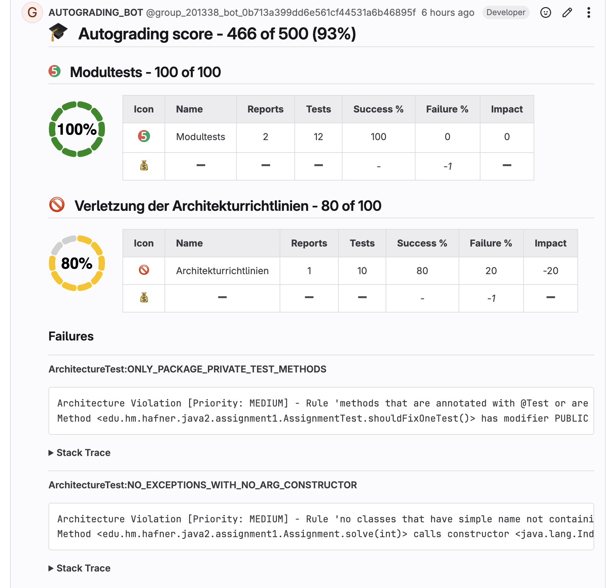
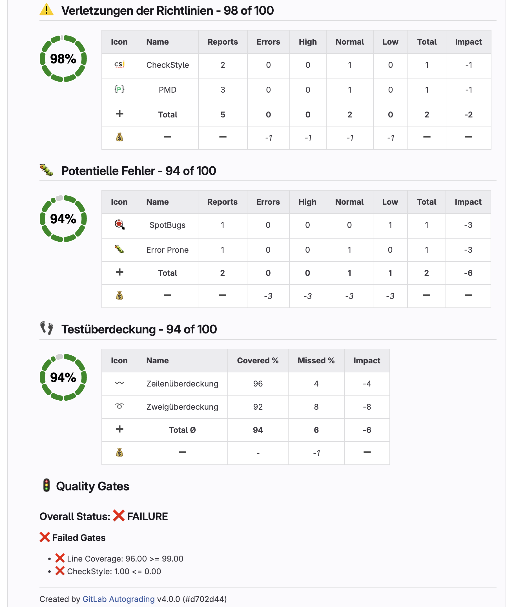
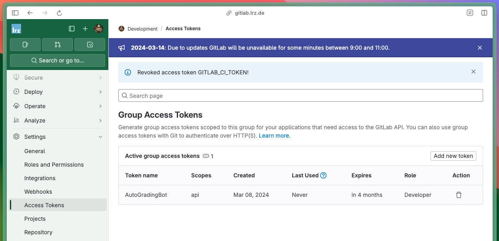
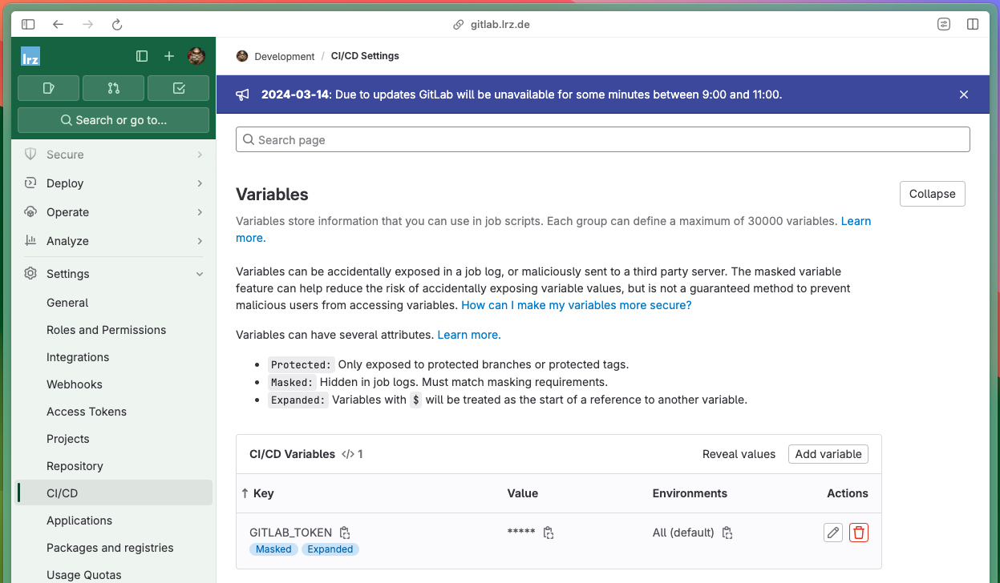
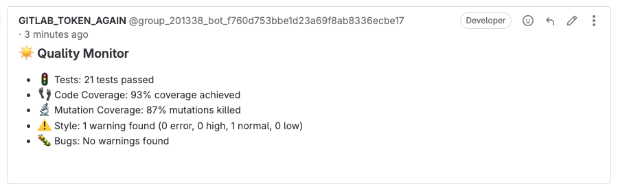
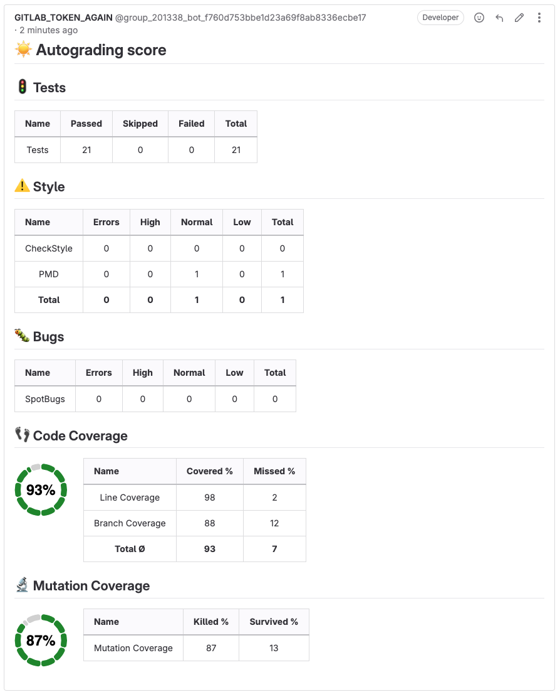

# Autograding GitLab Action 

[](https://github.com/uhafner/autograding-gitlab-action/actions/workflows/cd.yml)
[](https://github.com/uhafner/autograding-gitlab-action/actions/workflows/codeql.yml)

Automated scoring (autograding) and optional quality monitoring for GitLab merge requests and branch pipelines. 
The action aggregates test results, code and mutation coverage, static analysis findings, and software metrics, then posts a structured merge request note (plus inline line comments for warnings, missed or mutated lines when enabled). 
It can run in two modes: scoring mode (compute a numeric score from configurable impacts and maxScore values) or monitoring mode (omit maxScore to get a qualitative dashboard without a grade).
I use the scoring mode of this action to automatically grade student projects in my lectures at the Munich University of Applied Sciences.

It is inspired by the Jenkins [Warnings](https://plugins.jenkins.io/warnings-ng/) and [Coverage](https://plugins.jenkins.io/coverage) plugins and complemented by the GitHub variant (see: [Quality Monitor](https://github.com/uhafner/quality-monitor) and [Autograding GitHub Action](https://github.com/uhafner/autograding-github-action)). 
It works with any tech stack that can produce supported report files (JUnit or other xUnit style test reports, JaCoCo Cobertura OpenCover PIT coverage or mutation reports, and over one hundred static analysis formats via the shared analysis model). 
The action itself does not execute builds or analysis tools; you run those in earlier pipeline stages and pass their generated XML (or other) report artifacts to this container step.

Core advantages: consistent feedback for students or contributors, transparent scoring rules (JSON-based), fast re-runs (lightweight publication stage), and broad parser support without custom scripting. 
Use it to guide improvement (negative impacts for problems) or to reward achievements (positive impacts for passed tests or coverage percentages) or both.

Sample Outputs:
- [Merge Request with some failures and warnings](https://gitlab.lrz.de/dev/gitlab-autograding-example/-/merge_requests/2)
- [Merge Request with a score of 100 %](https://gitlab.lrz.de/dev/gitlab-autograding-example/-/merge_requests/1)
 
(Note: the project is hosted on our university's private GitLab instance, so without a proper login, you will not be able to see the details of the merge requests.)

## Example MR Comment 

The action posts a structured merge request note summarizing all enabled metrics. 
Inline notes (line comments) for failed tests, static analysis warnings, and missed or survived coverage items are added when not disabled.




## Key Features

- Unified quality summary in MR comment
- Inline annotations for warnings and missed coverage (optional limits)
- Quality gates (fail or mark unstable based on thresholds)
- Supports grouped metrics (tests, analysis, coverage, mutation, metrics)
- Configurable impacts and maximum score per metric

## Supported Reports

- Tests: JUnit, xUnit, NUnit
- Coverage & Mutation: JaCoCo, Cobertura, OpenCover, Open Clover, VectorCAST, Go Coverage, PIT
- Static Analysis: 100\+ formats (see [supported list](https://github.com/jenkinsci/analysis-model/blob/main/SUPPORTED-FORMATS.md))
- Software Metrics: PMD metrics file (cyclomatic, cognitive, NPath, LOC, NCSS, cohesion, weight)

## Prerequisites

The action does **not** run tests or analysis tools. Generate all reports in previous workflow steps, then invoke the action to collect and publish results.

## High-Level Workflow

1. Your build steps create supported XML or JSON reports.
2. The action parses the configured reports (or uses the default config).
3. It generates:
    - GitLab commit summary
    - Optional MR comment (when the pipeline is for a MR)
    - Optional source code annotations

## Usage

You can use this action in any GitLab pipeline.
It must be added as a separate step since it is packaged in a Docker container. 
This step must run after your normal build and testing steps so that it has access to all produced artifacts. 
Make sure to configure your build to produce the required report files (e.g., JUnit XML reports, JaCoCo XML reports, etc.) even when there are test failures or warnings found. 
Otherwise, the action will only show partial results.

In the following example, this step is bound to the `test` stage. 
You need to provide a GitLab access token as CI/CD Variable `GITLAB_TOKEN` to create comments in the merge request. 
The action will use the token to authenticate against the GitLab API. 
See the next section for details.

```yaml
build:
  stage: build # (compile, test with code and mutation coverage, and run static analysis)
  artifacts:
    paths:
      - target # Make results available for the autograding action in the next stage
  script:
    - mvn -V --color always -ntp clean verify -Dmaven.test.failure.ignore=true -Ppit

test:
  image: uhafner/autograding-gitlab-action:v3 # Or use a specific tag like 3.0.0
  stage: test
  variables: 
    # You need to provide a GitLab access token as CI/CD Variable GITLAB_TOKEN in the GitLab user interface 
    CONFIG: > # Override default configuration: grade only the test results
      {
      "tests": {
        "tools": [
          {
            "id": "junit",
            "name": "Unittests",
            "pattern": "**/target/*-reports/TEST*.xml"
          }
        ],
        "name": "Unit and integration tests",
        "failureRateImpact": -1,
        "maxScore": 100
        }
      }
    SKIP_LINE_COMMENTS: 'true'
  script:
    - java -cp @/app/jib-classpath-file edu.hm.hafner.grading.gitlab.GitLabAutoGradingRunner
```
You will find a complete [GitLab pipeline example](.gitlab-ci.yml) in the top-level folder, which can be used as a template for your own projects.
The example is also based on a Java project that uses Maven as a build tool.
The action is not limited to Java projects but can be used for any programming language that can generate the required report files (JUnit XML, JaCoCo XML, etc.).


## Action Parameters

This action can be configured using the following environment variables (see example above). 
Parameters are optional unless marked as required. 
Omitted parameters fall back to sensible defaults.
- ``CONFIG`` (string, JSON): Custom report mapping JSON (tests, coverage, analysis, metrics). If omitted, the built-in [default mapping](https://raw.githubusercontent.com/uhafner/autograding-model/main/src/main/resources/default-no-score-config.json) is used. Provide either inline (multi-line YAML scalar) or load from a file and pass via output. See [the autograding-model](https://github.com/uhafner/autograding-model?tab=readme-ov-file#metric-report-configuration) project for details.
- ``QUALITY_GATES`` (string, JSON): Quality gate definitions: `{ "qualityGates": [ { "metric": "<id>", "threshold": <number>, "criticality": "FAILURE|UNSTABLE" } ] }`, see [autograding-model](https://github.com/uhafner/autograding-model?tab=readme-ov-file#quality-gates) project. If omitted, no gates are enforced (the build result stays successful).
- ``DISPLAY_NAME`` (string, default: `Autograding score`): Custom name for the comment title.
- ``SKIP_LINE_COMMENTS`` (boolean, default: `false`): If `true`, suppress creation of per-line coverage and warning annotations.
- ``MAX_WARNING_COMMENTS`` (number, optional): Upper limit of warning annotations. Omit for unlimited.
- ``MAX_COVERAGE_COMMENTS`` (number, optional): Upper limit of missed coverage annotations. Omit for unlimited.
- ``SKIP_DETAILS`` (boolean, default: `false`): Optional flag to skip the details of the results (e.g., stack trace of failed tests, autograding detail tables) in the commit or merge request comment.
- ``SKIP_WARNING_DESCRIPTION: true`` (boolean, default: `false`): Optional flag to skip the adding of warning descriptions for static analysis warnings. 
Since static analysis tools like CheckStyle or SpotBugs have lengthy descriptions, it makes sense to skip the descriptions if you have many warnings.
- ``SKIP_COMMIT_COMMENTS`` (boolean, default: `false`): Optional flag to skip the creation of comments in commits. 
When this option is enabled, then comments are only added to merge requests. 
When all your changes are integrated in merge requests, then you can skip the commit comments to reduce the noise in the merge request: in this case, the comments in the merge request will be replaced with the results of the latest commit only.

## GitLab Access Token

The action needs a GitLab access token as a masked CI / CD variable to create comments in the commit notes or merge request. 
You can create a new token with a meaningful name in your GitLab user or group settings. 
This token name will be used as author for all notes. 
The token needs the permissions `api, read_api, read_repository, write_repository` 



This token then needs to be added as a CI/CD Variable in your GitLab project settings. 
The name of the variable must be `GITLAB_TOKEN` and the value is the token you just created.



## Monitoring Project Quality

You can also use this action to monitor the quality of your project without creating a grading score: use only configurations that do not set the `maxScore` properties. 
Then this action basically works like a stand-alone version of my Jenkins [Warnings](https://github.com/jenkinsci/warnings-ng-plugin) and [Coverage](https://github.com/jenkinsci/coverage-plugin) plugins, see the following screenshots.





# Crawling merge request results

There is also a crawler available that can be used to collect the results of multiple projects and aggregate them in a CVS file. 
The crawler is implemented in the [ResultCrawler](https://github.com/uhafner/autograding-gitlab-action/blob/main/src/main/java/edu/hm/hafner/grading/gitlab/ResultCrawler.java) class and can be used as follows:

```bash
mvn compile exec:java  -Dexec.args="assignment-group mr-label"
```

The `assignment-group` is the name of the assignment group (e.g., "assignment1") and the `mr-label` is the label of the merge requests (e.g., "solution"). 
The crawler will then collect all merge requests with the given label and write the results to a CSV file in the current directory.

