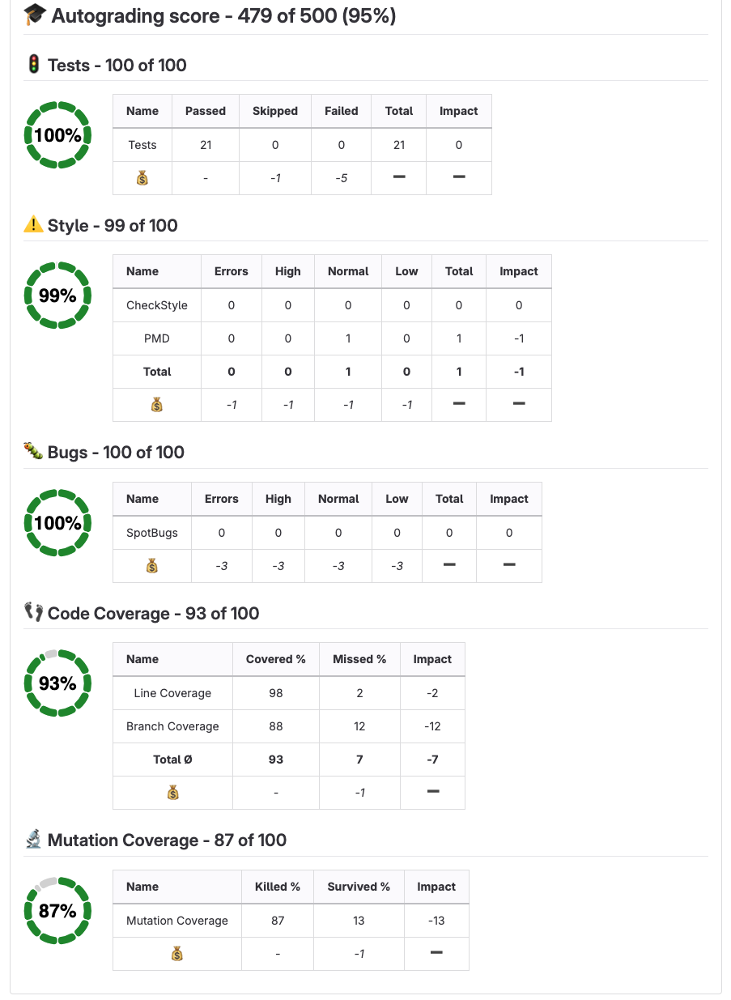
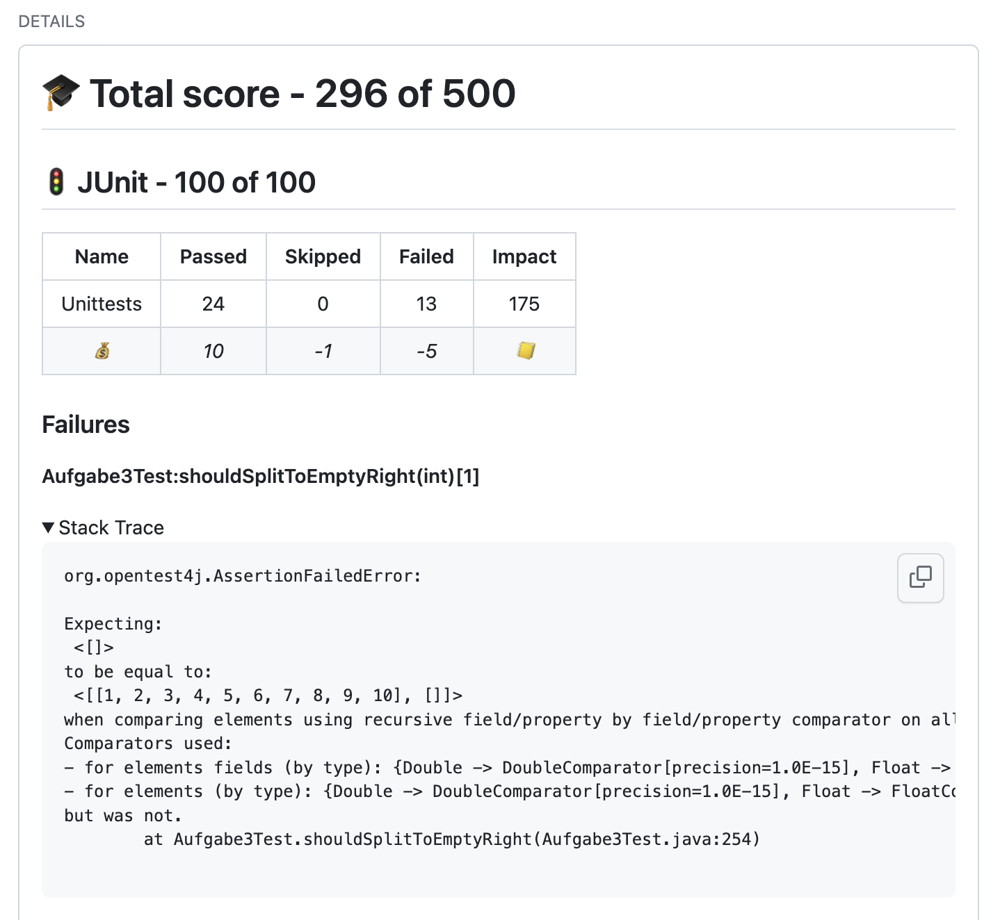
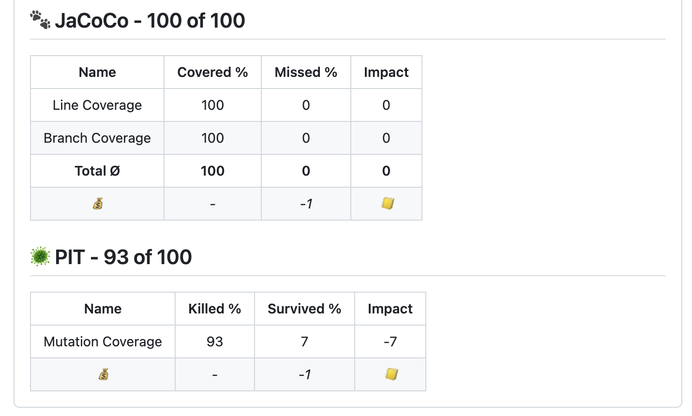
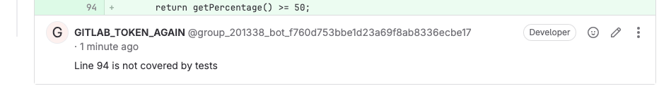
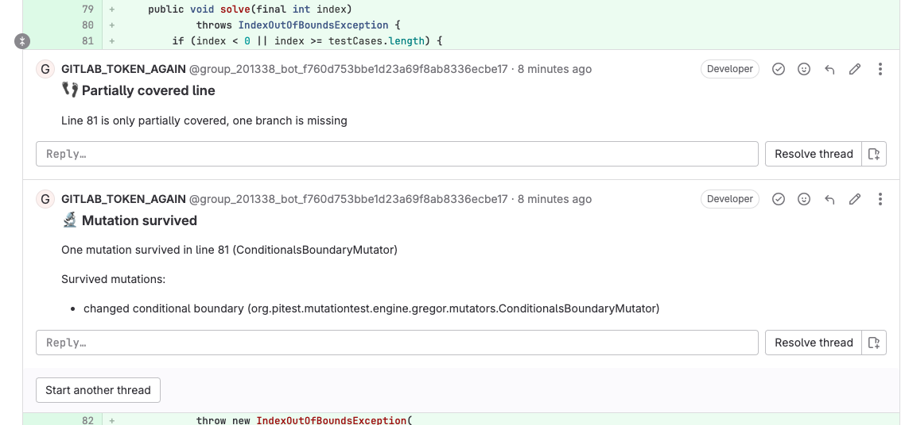
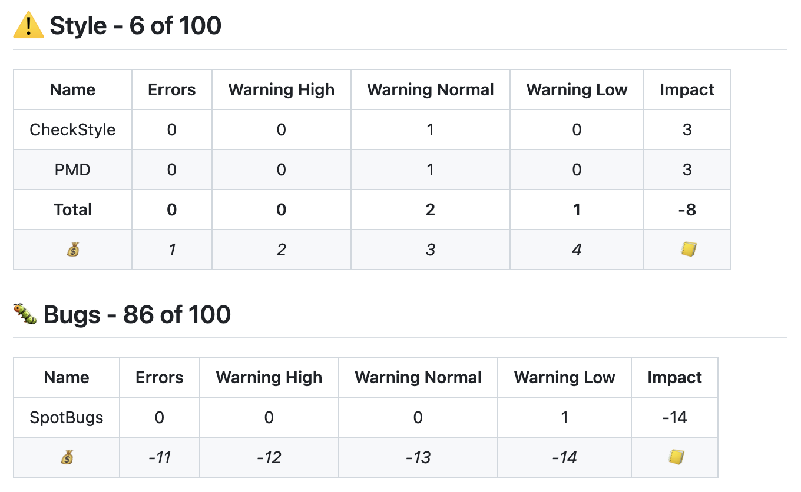
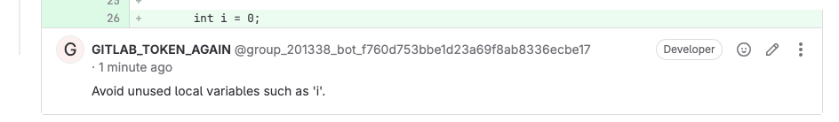

# Autograding GitLab Action 

[](https://github.com/uhafner/autograding-gitlab-action/actions/workflows/cd.yml)

This GitLab action autogrades projects based on a configurable set of metrics and gives feedback on merge requests (or single commits). I use this action to automatically grade student projects in my lectures at the Munich University of Applied Sciences.

You can see the results of this action in the [example pull request](https://gitlab.lrz.de/dev/java2-assignment1/-/merge_requests/5) of a fake student project.



Please have a look at my [companion coding style](https://github.com/uhafner/codingstyle) and [Maven parent POM](https://github.com/uhafner/codingstyle-pom) to see how to create Java projects that can be graded using this GitLab action. If you are hosting your project on GitHub, then you might be interested in my [similar GitHub action](https://github.com/uhafner/autograding-github-action) as well.

Both actions are inspired by my Jenkins plugins: 
- [Jenkins Warnings plugin](https://github.com/jenkinsci/warnings-ng-plugin)
- [Jenkins Coverage plugin](https://github.com/jenkinsci/coverage-plugin)
- [Jenkins Autograding plugin](https://github.com/jenkinsci/autograding-plugin)

They work in the same way but are much more powerful and flexible and show the results additionally in Jenkins' UI. 

Please note that the action works on report files that are generated by other tools. It does not run the tests or static analysis tools itself. You need to run these tools in a previous step of your pipeline. See the example below for details. This has the advantage that you can use a tooling you are already familiar with. So the action will run for any programming language that can generate the required report files. There are already more than [one hundred analysis formats](https://github.com/jenkinsci/analysis-model/blob/main/SUPPORTED-FORMATS.md) supported. Code and mutation coverage reports can use the JaCoCo, Cobertura and PIT formats, see the [coverage model](https:://github.com/jenkinsci/coverage-model) for details. 

# Configuration

The individual metrics can be configured by defining an appropriate `CONFIG` environment variable (in JSON format) in your GitLab pipeline:

```yaml
build:
  stage: build # (compile, test with code and mutation coverage, and run static analysis)
  artifacts:
    paths:
      - target # Make results available for the autograding action in the next stage
  script:
    - mvn -V --color always -ntp clean verify --file pom.xml '-Dgpg.skip' -Ppit

test:
  image: uhafner/autograding-gitlab-action:1.2.0
  stage: test
  variables:
    CONFIG: >
      {
      "tests": {
        "tools": [
          {
            "id": "test",
            "name": "Unittests",
            "pattern": "**/target/*-reports/TEST*.xml"
          }
        ],
        "name": "Unit and integration tests",
        "skippedImpact": -1,
        "failureImpact": -5,
        "maxScore": 100
        }
      }
    SKIP_LINE_COMMENTS: 'true'
  script:
    - java -cp @/app/jib-classpath-file edu.hm.hafner.grading.gitlab.GitLabAutoGradingRunner

```

Currently, you can select from the metrics shown in the following sections. Each metric can be configured individually. All of these configurations are composed in the same way: you can define a list of tools that are used to collect the data, a name and icon for the metric, and a maximum score. All tools need to provide a pattern where the autograding action can find the result files in the workspace (e.g., JUnit XML reports). Additionally, each tool needs to provide the parser ID of the tool so that the underlying model can find the correct parser to read the results. See [analysis model](https:://github.com/jenkinsci/analysis-model) and [coverage model](https:://github.com/jenkinsci/coverage-model) for the list of supported parsers.

Additionally, you can define the impact of each result (e.g., a failed test, a missed line in coverage) on the final score. The impact is a positive or negative number and will be multiplied with the actual value of the measured items during the evaluation. Negative values will be subtracted from the maximum score to compute the final score. Positive values will be directly used as the final score. You can choose the type of impact that matches your needs best.

## Test statistics (e.g., number of failed tests)



This metric can be configured using a JSON object `tests`, see the example below for details: 

```json
{
  "tests": {
    "tools": [
      {
        "id": "test",
        "name": "Unittests",
        "pattern": "**/junit*.xml"
      }
    ],
    "name": "JUnit",
    "passedImpact": 10,
    "skippedImpact": -1,
    "failureImpact": -5,
    "maxScore": 100
  }
}
``` 

You can either count passed tests as positive impact or failed tests as negative impact (or use a mix of both). For failed tests, the test error message and stack trace will be shown directly after the summary in the pull request.

## Code or mutation coverage (e.g., line coverage percentage)



This metric can be configured using a JSON object `coverage`, see the example below for details:

```json
{
  "coverage": [
    {
      "tools": [
        {
          "id": "jacoco",
          "name": "Line Coverage",
          "metric": "line",
          "sourcePath": "src/main/java",
          "pattern": "**/jacoco.xml"
        },
        {
          "id": "jacoco",
          "name": "Branch Coverage",
          "metric": "branch",
          "sourcePath": "src/main/java",
          "pattern": "**/jacoco.xml"
        }
      ],
      "name": "JaCoCo",
      "maxScore": 100,
      "coveredPercentageImpact": 1,
      "missedPercentageImpact": -1
    },
    {
      "tools": [
        {
          "id": "pit",
          "name": "Mutation Coverage",
          "metric": "mutation",
          "sourcePath": "src/main/java",
          "pattern": "**/mutations.xml"
        }
      ],
      "name": "PIT",
      "maxScore": 100,
      "coveredPercentageImpact": 1,
      "missedPercentageImpact": 0
    }
  ]
}
```

You can either use the covered percentage as positive impact or the missed percentage as negative impact (a mix of both makes little sense but would work as well). Please make sure to define exactly a unique and supported metric for each tool. For example, JaCoCo provides `line` and `branch` coverage, so you need to define two tools for JaCoCo. PIT provides mutation coverage, so you need to define a tool for PIT that uses the metric `mutation`. 

Missed lines or branches as well as survived mutations will be shown as comments in the merge request:




## Static analysis (e.g., number of warnings)



This metric can be configured using a JSON object `analysis`, see the example above for details:

```json
{
  "analysis": [
    {
      "name": "Style",
      "id": "style",
      "tools": [
        {
          "id": "checkstyle",
          "name": "CheckStyle",
          "pattern": "**/target/checkstyle-result.xml"
        },
        {
          "id": "pmd",
          "name": "PMD",
          "pattern": "**/target/pmd.xml"
        }
      ],
      "errorImpact": 1,
      "highImpact": 2,
      "normalImpact": 3,
      "lowImpact": 4,
      "maxScore": 100
    },
    {
      "name": "Bugs",
      "id": "bugs",
      "icon": "bug",
      "tools": [
        {
          "id": "spotbugs",
          "name": "SpotBugs",
          "sourcePath": "src/main/java",
          "pattern": "**/target/spotbugsXml.xml"
        }
      ],
      "errorImpact": -11,
      "highImpact": -12,
      "normalImpact": -13,
      "lowImpact": -14,
      "maxScore": 100
    }
  ]
}
```

Normally, you would only use a negative impact for this metric: each warning (of a given severity) will reduce the final score by the specified amount. You can define the impact of each severity level individually. 

All warnings will be shown as comments in the merge request:



## Action Parameters

This action can be configured using the following environment variables (see example above):
- ``GITLAB_TOKEN``: mandatory GitLab access token.
- ``CONFIG: "{...}"``: optional configuration, see sections above for details, or consult the [autograding-model](https://github.com/uhafner/autograding-model) project for the exact implementation. If not specified, a [default configuration](https://github.com/uhafner/autograding-model/blob/main/src/main/resources/default-config.json) will be used.
- ``DISPLAY_NAME: "Name in the comment title"``: optional name in the comment title (overwrites the default: "Autograding score").
- ``SKIP_LINE_COMMENTS: true``: Optional flag to skip the creation of commit comments at specific lines (for warnings and missed coverage).
- ``SKIP_DETAILS: true``: Optional flag to skip the details of the results (e.g., stack trace of failed tests, autograding detail tables) in the commit or merge request comment.
